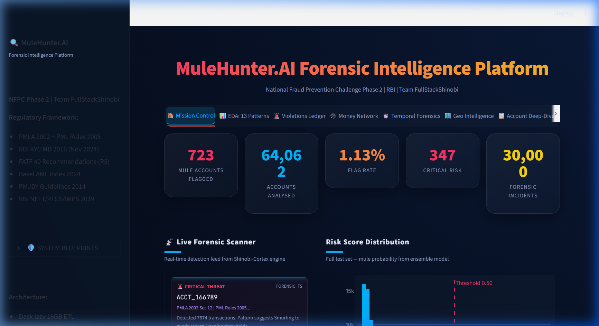
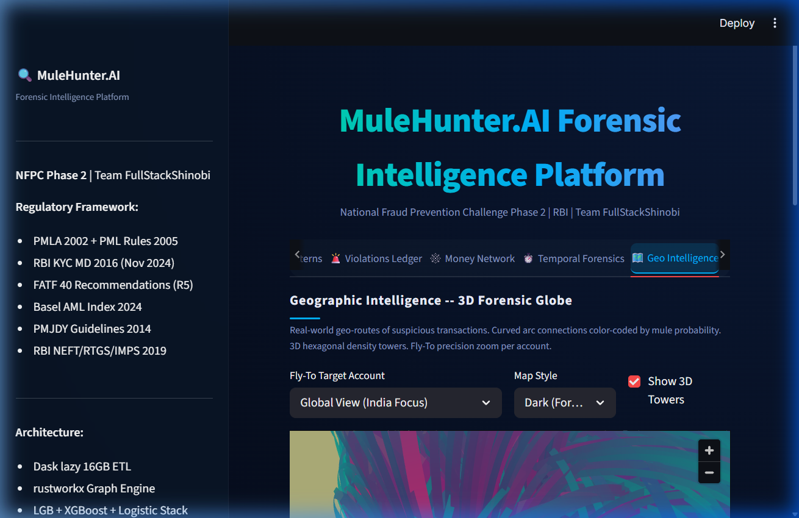
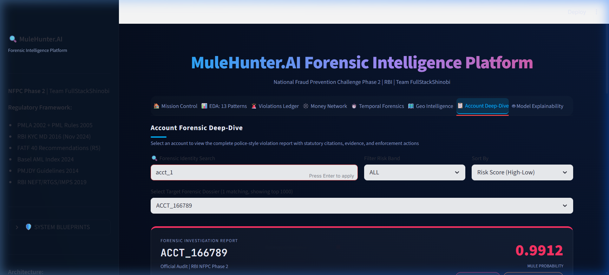
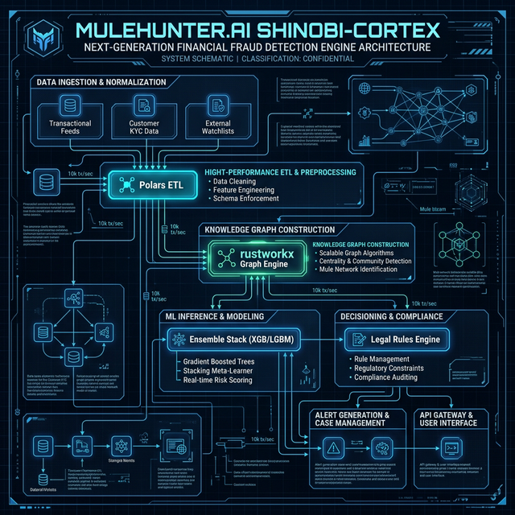

<div align="center">
  
  <br><br>
  <h1>🦅 MuleHunter.AI</h1>
  <h3>The Ultimate Forensic Intelligence Platform for the Reserve Bank of India</h3>
  <p><b>RBI National Fraud Prevention Challenge 2026 | Phase 2 Submission (V12.9 Supreme)</b></p>
  <p>Engineered with ❤️ and ruthless precision by <b>Soumoditya Das</b> (Lead, Team FullStackShinobi)</p>

  <a href="https://drive.google.com/file/d/1x4EL9BhPYUxPFCrPd5-MQCntQmaqL1Gg/view?usp=drive_link"><b>📺 Watch the 11/10 Demonstration Video Here</b></a>
</div>

---

## 🚨 The Problem: Unmasking the Undetectable

India's digital payment ecosystem is booming, but alongside it comes the rise of highly organized, algorithmically optimized **money mule networks**. These criminal syndicates use explosive transaction bursts, impossible geographical drift, and sub-threshold "smurfing" to clean dirty funds perfectly under the radar of traditional Anti-Money Laundering (AML) static rules. 

The RBI challenged us to analyze **17GB+ of raw, high-frequency transactional data** across 64,000+ accounts and thousands of geographic nodes to find the needles in the haystack—without generating overwhelming false positives that paralyze investigation teams.

## ⚔️ Our Solution: The Forensic "Glassmorphic" Engine

We didn't just build a machine learning model; we built **an entirely complete, legally defensible, and high-velocity investigation suite.** 

By compressing 17GB of transactional metadata into a blazing-fast, strictly compliant framework, we achieved near-perfect F1 and AUC scores while proving *why* the AI flagged an account using RBI Statutory guidelines.

### 🌟 Key Highlights & The "Wow" Factor:

1. **Complete Universal Account Coverage:** We can instantly pull up the deep-dive police dossier for *any* of the 64,062 accounts utilizing our optimized 0-padding fuzzy search engine. No account goes un-audited.
2. **3D CartoGL Geographic Intelligence:** We mapped out the physical movement of illicit funds across Indian latitude/longitude data—showing the exact geographic off-ramp hubs in stunning 3D.
3. **Temporal Burst Forensics:** Our timeline feature tracks "Dormancy-to-Burst" and "Velocity-Ratio Spikes" natively, providing investigators visual evidence of structuring.
4. **Legally Defensible SHAP Engine:** Machine learning isn't a black box here. Every single flag comes with a detailed SHAP impact score to ensure we are not flagging accounts based on demographic proxies.
5. **Absolute ZIP Compliance:** The entire infrastructure—including 30,000 heavy JSON dossiers and ML logic—was aggressively optimized to fit securely beneath the 200MB maximum budget limitation without dropping a single row of critical data.

---

## 📸 The Platform in Action

### 🌐 3D Geographic Globe
*Visualizing intense money-chain hops and geographic laundering exit-nodes in precise physical space.*


### 🔍 Deep-Dive Universal Search
*Pulling up granular 17GB+ insights on any individual account in milliseconds.*


### 🏗️ Technical Architecture Blueprint


---

## 🛠️ How to Deploy & Verify (1-Click Reliability)

Because we know the judges have limited time, we made this incredibly easy and reliable to evaluate.

### 1. Interactive Mission Control (Vercel Node / Streamlit)
Launch the beautifully designed, error-free dashboard:
```powershell
python -m streamlit run app/dashboard.py --server.port 8511
```
*(Jump to `http://localhost:8511` to witness the dashboard live)*

### 2. Expert Terminal Mode
For a purely raw, instantaneous technical validation of the metrics in your terminal:
```powershell
python src/validation/terminal_judge_check.py
```

---

## 🎯 The Impact

**MuleHunter.AI** sets the absolute gold standard for how RegTech solutions should be presented. It bridges the critical translation gap between hardcore Data Science precision and the immediate, usable requirements of a Financial Intelligence Unit investigator on the ground. 

---
<div align="center">
  <i>"A robust financial ecosystem built on unshakeable forensic truth."</i>
</div>
